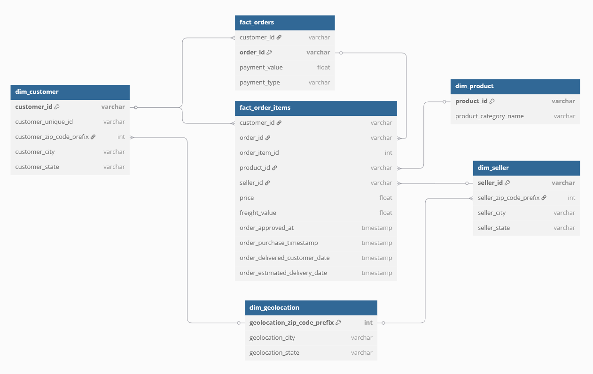

### ERD Diagram




```yaml
Table fact_orders {
  customer_id varchar [ref: > dim_customer.customer_id]
  order_id varchar [pk]
  payment_value float
  payment_type varchar
}

Table fact_order_items {
  customer_id varchar [ref: > dim_customer.customer_id]
  order_id varchar [ref: > fact_orders.order_id]
  order_item_id int
  product_id varchar [ref: > dim_product.product_id]
  seller_id varchar [ref: > dim_seller.seller_id]
  price float
  freight_value float
  order_approved_at timestamp
  order_purchase_timestamp timestamp
  order_delivered_customer_date timestamp
  order_estimated_delivery_date timestamp
}

Table dim_customer {
  customer_id varchar [pk]
  customer_unique_id varchar
  customer_zip_code_prefix int [ref: > dim_geolocation.geolocation_zip_code_prefix]
  customer_city varchar
  customer_state varchar
}

Table dim_product {
  product_id varchar [pk]
  product_category_name varchar
}

Table dim_seller {
  seller_id varchar [pk]
  seller_zip_code_prefix int [ref: > dim_geolocation.geolocation_zip_code_prefix]
  seller_city varchar
  seller_state varchar
}

Table dim_geolocation {
  geolocation_zip_code_prefix int [pk]
  geolocation_city varchar
  geolocation_state varchar
}
```
